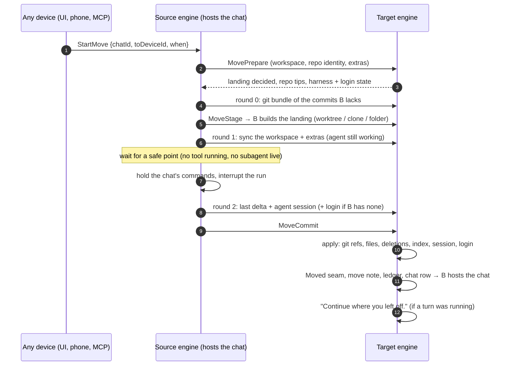

# Moving a chat to another device

Move a chat, while its agent is working, from one of your engines to another:
from your laptop to your desktop before you leave, or onto a build server.
The chat continues there with its conversation, its project folder (including
ignored files like `.env`), the files it was using elsewhere on disk, and the
agent's own session. Moving it back later is fast, because only what changed
travels.

Plan and reasoning: [`plans/2026-09-30-agent-mobility-and-policy.md`](plans/2026-09-30-agent-mobility-and-policy.md),
Part 1. The code lives in `crates/engine/src/moves/` (source and target
engines), the sync mode of `crates/transfer` (rsync-style rounds),
`crates/harness/src/portable.rs` (agent sessions) and the engine's
agent-account login handoff.

## How it works

Processes don't move; state does. Model calls are stateless, so an agent can
be rebuilt from three things: the conversation (already synced), the
workspace, and the harness's own session file. A move copies those while the
agent keeps working, stops the agent between two steps, sends the last
changes, and the new device resumes the agent's session natively.

`when: now` skips the wait and interrupts the current step. A cancel before
the commit puts everything back: the source lifts its hold and continues a
run it stopped, and the target removes what it created.

### What travels

| Root | Contents | Lands on the target |
| --- | --- | --- |
| `ws` | The workspace: the git repository root (or the chat's folder), everything except `.git` and regenerable folders (`node_modules`, `target`, `.venv`, `dist`, …) | Where the chat was before; else a worktree of a checkout of the same repository (matched by root commit); else a clone; else the same home-relative path, or `~/Zeron/Moved/<name>` |
| `x0…` | Files outside the workspace the session used (found in its tool calls) or the scout agent pointed at | Back where they came from; else the same home-relative path if free; else `~/Zeron Transfers/Moves/<chat>/` |
| `up` | Images attached in the transcript | The target's uploads folder (old messages resolve by file name) |
| `hs` | The agent's own session files | The harness's store, cwd fields rewritten |
| `login` | The agent's login, only when the target has none | The target's agent accounts |
| `git` | Bundles of the commits the target lacks | Fetched into the landing's repository |

Git state travels as git: commits as bundles, the branch (fast-forwarded, or
landed under `<branch>-from-<device>` when it diverged on the target), and the
index as a staged patch. The working tree travels as files.

Secret stores are never carried (`~/.ssh`, `~/.aws`, keychains, CLI
credential files), and neither is the home folder as a whole: a chat working
directly in `~` carries only the files it used.

### Rsync-style rounds

Each round is a sync transfer (a `zeron-transfer` mode only moves use). Its
ticket was registered by the target, which chose the staging folder. Files
whose content the target already has (compared by SHA-256, through a hash
cache on both sides) are not sent. Large files that differ send only their
changed 1 MiB blocks. Round 2 compares against round 1's staging first, so
nothing is sent twice. Nothing outside staging changes before the commit.

### The scout

While round 1 runs, a short tool-less run of the chat's harness (cheapest
model, scratch folder, one minute) reads the end of the conversation. It
names any other files the work needs and writes notes for the agent ("restart
the dev server with `npm run dev`"). It is best effort: its paths are
validated like harvested ones, and a move never waits on it.

### The agent after the move

The transcript shows a *Moved* divider. Before its first prompt on the new
device, the agent receives a note listing:

- paths that changed;
- processes left running on the old device;
- a question it was waiting on;
- the scout's advice.

Harnesses whose sessions can't be carried (OpenCode, Devin, Hermes,
Antigravity) start a fresh session that receives the conversation once,
together with the note.

### Safety

- **Only the host can start a move.** The host is the only writer of the
  chat's placement, so moves are serialised without a server-side lock.
- **The source holds the chat's commands and queue** from the moment it
  stops the agent. Commands sent meanwhile wait in the synced doc for
  whichever engine ends up hosting the chat. After a successful move the
  source keeps holding them until its own registry shows the new host.
- **The processed-command ledger travels with the chat**, so the new host
  never runs a command twice. A former host answers relayed commands with
  "not host".
- **The placement is one registry `Update`**: host, space, folder, branch and
  resume session together. It is the target's last step. Nothing after it
  can fail the commit, and an abort that arrives while the commit applies
  stops it just before the flip.
- **A failure after the commit went out is never resolved by guessing.** The
  source asks the target whether it committed, is still applying, or
  aborted, and keeps the chat parked until it knows, so the agent never runs
  on both devices.
- **Nothing is deleted from partial or foreign state.**
  - Deletions use the source's full file list.
  - They happen only in a landing this move created, or for files exactly as
    this device had them when the chat last left.
  - A workspace too large to list completely fails the move instead of
    syncing a subset.
- **Any file replaced with other local content is backed up** to
  `{store}/moves/backups/<move>/` and reported. That covers both a file the
  user changed here since the chat left and an extra outside the workspace.
- **Peers can't choose where files land.** Extras stay inside the target's
  home, out of secret stores and away from places that run things (shell
  startup files, autostart folders).

## Surfaces

- **Desktop:**
  - **Move to…** in the chat header, the session menu and the command
    palette;
  - a device picker showing which devices can take the chat and which login
    they'll use;
  - a banner with progress, **Move now** and **Cancel**.
- **MCP:** `move_chat {chat?, device, when?}`. `get_chat` reports `move`.
- **RPC:**
  - `StartMove`, `MoveNow`, `CancelMove`, `MoveCandidates` (forwardable to the
    chat's host);
  - `MoveProbe`, `MovePrepare`, `MoveStage`, `MoveCommit`, `MoveAbort`
    (engine ⇄ engine);
  - capability `session-move-v1`.
- **Progress:** the host publishes it on the chat's registry row (`move`), so
  every device and phone shows the same state.

## Limits

- Both engines need an edge (a signed-in account, or a development or local
  edge). The chat must have finished syncing (chat2).
- Running processes don't move; the agent is told which ones were running.
- Regenerable folders aren't copied; the agent is told to rebuild them.
- A move during a long tool call waits for it unless you choose **Move now**.
- Copying a login between devices can make one of them sign in again later,
  if the provider rotates refresh tokens.
